# SI-084 · Auditoría de Sistemas — Examen Práctico Unidad I
## COOPAC Santa Rosa · Auditoría del Core Financiero

<p align="center">
  
  &nbsp;&nbsp;&nbsp;
  
</p>

<p align="center">
  <strong>Universidad Privada de Tacna</strong><br>
  Escuela Profesional de Ingeniería de Sistemas<br>
  SI-084 · Auditoría de Sistemas · Dr. Oscar Juan Jiménez Flores
</p>

---

| Campo | Detalle |
|---|---|
| **Alumno** | Anampa Pancca, David Jordan |
| **Código** | 2022074268 |
| **Curso** | SI-084 · Auditoría de Sistemas |
| **Rama de entrega** | `UNIDAD-I` |
| **Tag de entrega** | `examen-u1` |
| **Repositorio** | [si084_caso_coopac_examen_u1_David_Anampa](https://github.com/David-Anampa/si084_caso_coopac_examen_u1_David_Anampa/tree/examen-u1) |

---

## 📋 Descripción del caso

La **COOPAC Santa Rosa** es una cooperativa de ahorro y crédito. El Consejo de Administración solicita verificar si el servidor de base de datos del **core financiero** cumple con la Política de Seguridad aprobada (7 reglas, R1–R7), con corte al **31/12/2025**.

---

## 🗂️ Estructura del repositorio

```
si084_caso_coopac_David_Anampa/
├── INFORME.md                          # Informe de auditoría completo
├── docker-compose.yml                  # Configuración del servidor de BD
├── bd/
│   └── 01_core.sql                     # Schema y datos iniciales
├── datos/
│   ├── empleados.csv                   # 96 empleados
│   ├── usuarios_core.csv               # 119 usuarios del sistema
│   └── desembolsos.csv                 # 4813 operaciones de desembolso
├── politica/
│   └── POLITICA-DE-SEGURIDAD.md        # 7 reglas R1–R7 (NTP-ISO/IEC 27001)
├── respaldos/
│   ├── respaldo.sh                     # Script de respaldo automático
│   ├── respaldo.log                    # Registro de ejecuciones
│   └── core_2025-11-1{2,3,4}.sql       # Últimos respaldos exitosos
└── evidencias/
    ├── P1_puertos.txt                  # R1 — Exposición de puertos
    ├── P2_credenciales.txt             # R2 — Contraseñas en texto plano
    ├── P3_roles.txt                    # R3 — Superusuarios no autorizados
    ├── P4_cesados.txt                  # R4 — Cuentas de personas cesadas
    ├── P4_genericas.txt                # R4 — Cuentas sin responsable
    ├── P5_segregacion.txt              # R5 — Violaciones de segregación
    ├── P6_registro.txt                 # R6 — Registro de eventos
    ├── P7_respaldos.txt                # R7 — Estado de respaldos
    ├── P7_restauracion.txt             # R7 — Prueba de restauración
    └── SHA256SUMS.txt                  # Sellado de integridad
```

---

## 🚀 Paso 1 — Levanta el servidor

### Descarga del paquete

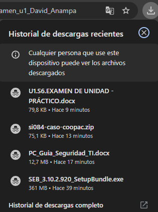

### Carpeta del proyecto en Documentos

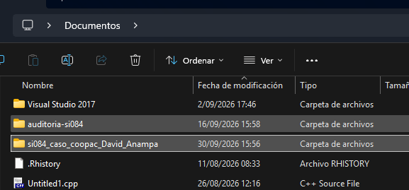

### Levantando el servidor con Docker

```bash
docker compose up -d --wait
```

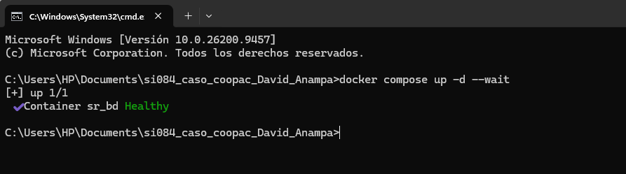

---

## 🔍 Paso 2 — Procedimientos de auditoría (P1–P7)

### P1 · Regla R1 · Exposición de la base de datos

```bash
docker compose ps | tee evidencias/P1_puertos.txt
```

**Resultado:** El servicio `sr_bd` publica en `0.0.0.0:55432` → expuesto a **toda la red**. ❌ **No cumple R1**

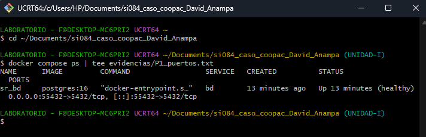

---

### P2 · Regla R2 · Contraseñas en texto plano

```bash
grep -n "PASSWORD" docker-compose.yml | tee evidencias/P2_credenciales.txt
```

**Resultado:** `POSTGRES_PASSWORD` encontrada en texto plano en `docker-compose.yml`, línea 10. Contraseña de solo **10 caracteres** (mínimo requerido: 12). ❌ **No cumple R2**

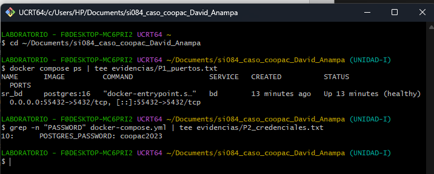

---

### P3 · Regla R3 · Cuentas con privilegio de Superusuario

```bash
docker exec sr_bd psql -U postgres -d core -c "\du" | tee evidencias/P3_roles.txt
```

**Resultado:** La cuenta `app_core` tiene atributo **Superuser** además de `postgres`. ❌ **No cumple R3**

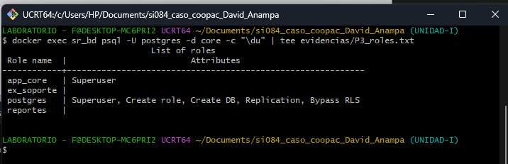

---

### P4 · Regla R4 · Cuentas de personas cesadas y sin responsable

```bash
# Cuentas de personas cesadas
docker exec sr_bd psql -U postgres -d core -c \
  "SELECT u.usuario, e.nombre, e.fecha_cese FROM usuarios u
   JOIN empleados e ON e.documento = u.documento
   WHERE u.estado = 'activo' AND e.fecha_cese IS NOT NULL
   ORDER BY e.fecha_cese" | tee evidencias/P4_cesados.txt
```

**Resultado:** **16 cuentas activas** pertenecen a **10 personas cesadas**. Cese más antiguo: **2015-12-18**. ❌ **No cumple R4**

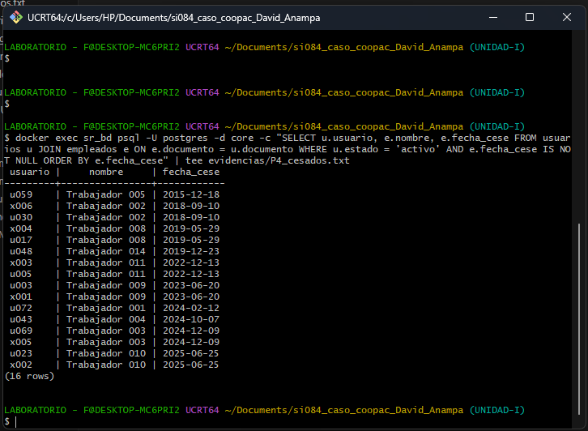

```bash
# Cuentas sin responsable (sin documento)
docker exec sr_bd psql -U postgres -d core -c \
  "SELECT usuario, perfil FROM usuarios
   WHERE documento IS NULL AND estado = 'activo'
   ORDER BY perfil, usuario" | tee evidencias/P4_genericas.txt
```

**Resultado:** **22 cuentas activas sin documento** (sin persona responsable), de las cuales **4 tienen perfil ADMIN**. ❌ **No cumple R4**

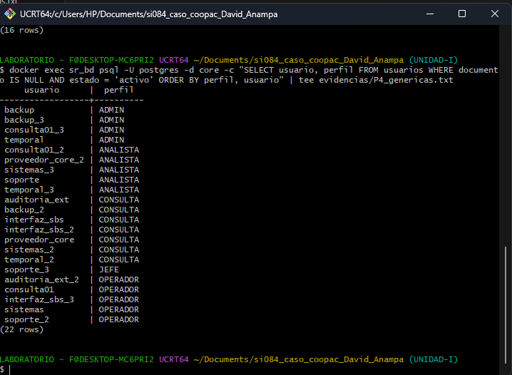

---

### P5 · Regla R5 · Segregación de funciones en desembolsos

```bash
# Conteo de violaciones
docker exec sr_bd psql -U postgres -d core -c \
  "SELECT count(*) AS casos, sum(monto) AS monto_total,
          count(DISTINCT usuario_registra) AS usuarios
   FROM desembolsos
   WHERE usuario_registra = usuario_aprueba
     AND monto > umbral_aprobacion" | tee evidencias/P5_segregacion.txt
```

**Resultado:** **23 casos**, monto total **S/ 709 370.47**, **21 usuarios distintos**. ❌ **No cumple R5**

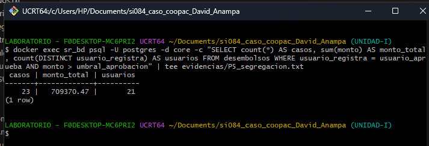

```bash
# Detalle de operaciones violadas
docker exec sr_bd psql -U postgres -d core -c \
  "SELECT id, fecha, monto, usuario_registra FROM desembolsos
   WHERE usuario_registra = usuario_aprueba
     AND monto > umbral_aprobacion
   ORDER BY monto DESC" | tee -a evidencias/P5_segregacion.txt
```

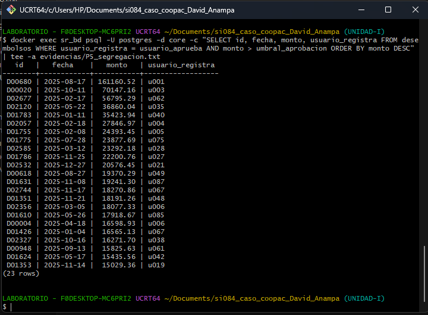

---

### P6 · Regla R6 · Registro de conexiones y modificaciones

```bash
docker exec sr_bd psql -U postgres -d core \
  -c "SHOW log_connections" -c "SHOW log_statement" | tee evidencias/P6_registro.txt
```

**Resultado:** `log_connections = off` / `log_statement = none`. Para cumplir R6 deberían ser `on` y `mod`. ❌ **No cumple R6**

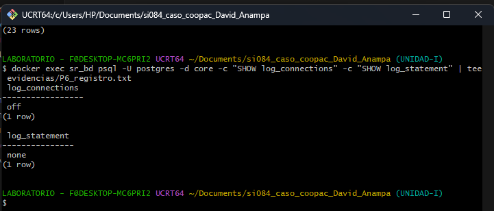

---

### P7 · Regla R7 · Respaldo y prueba de restauración

```bash
# Ver respaldos y últimas 5 líneas del log
ls respaldos/ | tee evidencias/P7_respaldos.txt
tail -n 5 respaldos/respaldo.log | tee -a evidencias/P7_respaldos.txt
```

**Resultado:** Último respaldo exitoso: **2025-11-14**. Desde 2025-11-15 al 2025-12-31: **47 días consecutivos de error** `No space left on device`. ❌ **No cumple R7**

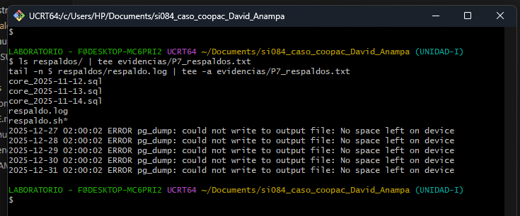

```bash
# Crear base de restauración
docker exec sr_bd psql -U postgres -c "CREATE DATABASE restauracion"
```

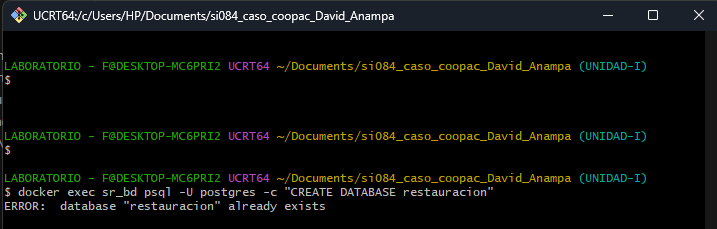

```bash
# Restaurar el último respaldo
docker exec -i sr_bd psql -U postgres -d restauracion < respaldos/core_2025-11-14.sql
```

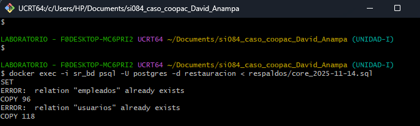

```bash
# Verificar tablas restauradas
docker exec sr_bd psql -U postgres -d restauracion -c "\dt" | tee evidencias/P7_restauracion.txt
```

**Resultado:** Solo se restauraron `empleados` y `usuarios`. La tabla **`desembolsos` NO existe** en el respaldo (excluida con `--exclude-table` en `respaldo.sh`). ❌ **No cumple R7**

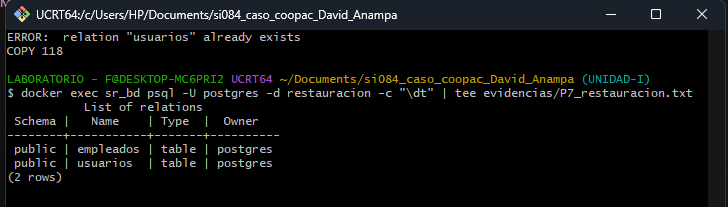

---

## 📊 Resumen de resultados

| Regla | Control NTP-ISO/IEC 27001 | ¿Cumple? |
|---|---|:---:|
| R1 — Exposición de red | A.8.20 Seguridad de redes | ❌ No |
| R2 — Contraseñas | A.5.17 Información de autenticación | ❌ No |
| R3 — Superusuario | A.8.2 Derechos de acceso privilegiado | ❌ No |
| R4 — Cuentas cesadas/sin responsable | A.5.16 Gestión de identidades · A.5.18 | ❌ No |
| R5 — Segregación de funciones | A.5.3 Segregación de funciones | ❌ No |
| R6 — Registro de eventos | A.8.15 Registro de eventos | ❌ No |
| R7 — Respaldo y restauración | A.8.13 Respaldo de la información | ❌ No |

> ⚠️ **El servidor de base de datos del core financiero incumple las 7 reglas de la Política de Seguridad.**

---

## 📤 Paso 4 — Sellado y subida a GitHub

```bash
sha256sum evidencias/*.txt > evidencias/SHA256SUMS.txt
```

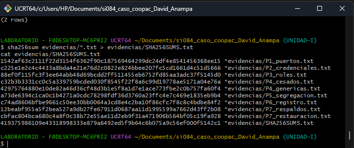

```bash
git init -b main
git add .
git commit -m "Caso COOPAC · examen practico U1"
git remote add origin https://github.com/David-Anampa/si084_caso_coopac_examen_u1_David_Anampa.git
git push -u origin main
```

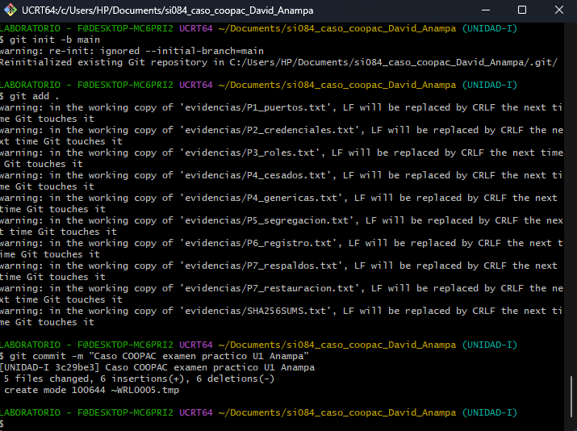

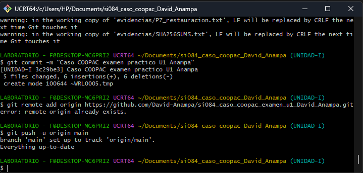

```bash
git tag examen-u1
git push origin examen-u1
```

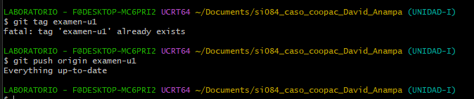

---

## 🛑 Paso 5 — Apagar el servidor

```bash
docker compose down -v
```

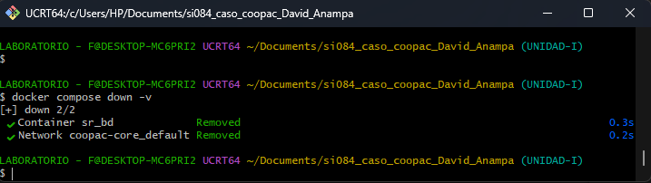

---

## 📁 Evidencias generadas

| Archivo | Procedimiento | Regla |
|---|---|---|
| `evidencias/P1_puertos.txt` | `docker compose ps` | R1 |
| `evidencias/P2_credenciales.txt` | `grep -n "PASSWORD"` | R2 |
| `evidencias/P3_roles.txt` | `\du` en psql | R3 |
| `evidencias/P4_cesados.txt` | JOIN usuarios-empleados | R4 |
| `evidencias/P4_genericas.txt` | `documento IS NULL` | R4 |
| `evidencias/P5_segregacion.txt` | `usuario_registra = usuario_aprueba` | R5 |
| `evidencias/P6_registro.txt` | `SHOW log_connections/log_statement` | R6 |
| `evidencias/P7_respaldos.txt` | `ls respaldos/ + tail log` | R7 |
| `evidencias/P7_restauracion.txt` | `\dt` tras restaurar | R7 |
| `evidencias/SHA256SUMS.txt` | Sellado de integridad | — |

---

*SI-084 · Auditoría de Sistemas · Dr. Oscar Juan Jiménez Flores · Tacna, Perú*
